# R3VP - Ransomware Readiness and Recovery Validation Platform

**Built by Omar Rao, Engineer - Data Resilience, Cybersecurity and Privacy**
[LinkedIn](https://www.linkedin.com/in/omarrao/) | [Substack](https://omarrao.substack.com/)

---

Most organizations assume their backups work. R3VP proves it.

R3VP is an automated recovery validation platform that connects to your Veeam Backup and Replication environment and VMware vCenter, spins up isolated recovery tests on a schedule, measures real RTO and RPO numbers, and reports results to a cloud portal. Phase 5 extended coverage to VMware, Hyper-V, Azure, and AWS. Phase 6 adds Proxmox, Nutanix, RHV, XenServer, Sangfor, and Google Cloud, bringing total provider coverage to 10 platforms so every workload gets validated regardless of where it lives. No more manual DR drills. No more guessing whether you can actually recover within your SLA window.

---

## How It Works

R3VP has three parts: a lightweight appliance you deploy inside your environment, a SaaS management portal in the cloud, and a workflow engine that ties them together.

### The Appliance

You run a small Docker container (or OVA) inside your network. It sits next to your Veeam server and vCenter. It reads your backup jobs, discovers protected VMs, and runs recovery tests autonomously on whatever schedule you set. All your Veeam and vCenter credentials stay encrypted inside your environment and never leave it.

The appliance communicates outbound only. It does not open any inbound ports. It calls the SaaS portal over HTTPS with mutual TLS to report test results and receive test instructions.

### What Happens During a Recovery Test

1. The appliance syncs your workload inventory from Veeam and vCenter
2. It picks the most recent consistent restore point for the VM under test
3. It provisions an isolated network in vCenter (a temporary VLAN with no access to production)
4. It triggers Veeam Instant Recovery for that VM into the isolated network
5. It waits for the VM to boot by polling VMware Tools
6. It runs health checks: OS responsiveness, network reachability, application-specific checks (Active Directory LDAP, SQL Server connectivity, DNS, Kerberos, SYSVOL)
7. It captures evidence: a console screenshot, event log, health check JSON
8. It calculates actual RTO (time from test start to confirmed application health) and RPO (age of the restore point used)
9. It tears down the isolated environment: stops the recovery session, removes the VLAN, cleans up
10. It posts the result to the SaaS portal

The whole cycle runs in an isolated bubble that has zero impact on production systems.

### The Portal

The SaaS portal shows you readiness scores, RTO and RPO trends over time, which workloads have never been tested, and which ones missed their SLA targets. Every test produces a downloadable PDF evidence report suitable for auditors and cyber insurance requirements.

### Multi-Cloud Support (Phase 5)

R3VP supports four infrastructure providers:

- **VMware vSphere + Veeam B&R** (Phases 1-3): The original flow. Veeam detects protected VMs, vCenter provisions the isolated VLAN, Veeam performs instant recovery.
- **Microsoft Hyper-V** (Phase 5): WMI-based VM inventory and checkpoint recovery on Windows hosts with the Hyper-V role.
- **Azure Backup** (Phase 5): Recovery Services Vault integration. Test restores run to a dedicated isolated resource group with no production network access.
- **AWS Backup** (Phase 5): Vault and EC2 recovery point inventory. Test restores run to an isolated VPC subnet with no internet gateway.

The provider is configured per appliance via the `R3VP_PROVIDER` environment variable. All four providers use the same Temporal workflow engine, the same health check module, and the same portal for results.

### Extended Hypervisor and Cloud Coverage (Phase 6)

Phase 6 adds six more connectors, bringing total coverage to 10 infrastructure providers.

| Provider | Protocol | Status |
|----------|----------|--------|
| VMware vSphere + Veeam B&R | Veeam REST API v1.2 + pyVmomi | Active (Phase 1) |
| Microsoft Hyper-V | WMI (pywin32) | Active (Phase 5) |
| Azure Backup | azure-mgmt-recoveryservicesbackup + Managed Identity | Active (Phase 5) |
| AWS Backup | boto3 + IAM Instance Profile | Active (Phase 5) |
| Proxmox VE | proxmoxer REST API + PBS integration | Phase 6 |
| Nutanix AHV | Prism Central v3 REST API | Phase 6 |
| RHV / oVirt | oVirt Engine Python SDK | Phase 6 |
| XenServer / Citrix Hypervisor | XenAPI XML-RPC | Phase 6 |
| Sangfor HCI | Vendor REST API with token auth | Phase 6 |
| GCP Compute Engine | google-cloud-compute + Application Default Credentials | Phase 6 |

**New dependencies added in Phase 6:**

```toml
# apps/appliance/pyproject.toml (optional extras)
proxmoxer>=2.0
google-cloud-compute>=1.14
google-auth>=2.28
# ovirt-engine-sdk-python>=4.6 (Linux only, for RHV/oVirt)
```

**Providers page (Phase 6):**

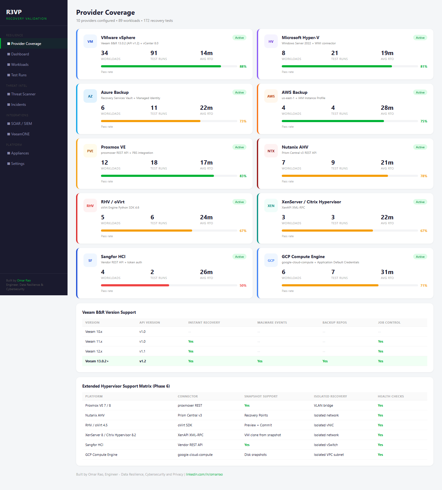

The providers page shows a 10-provider tabbed interface

### Compliance and Reporting (Phase 7)

Phase 7 adds enterprise-grade compliance evidence generation. Every recovery test run produces audit data that maps to security control frameworks required by InfoSec teams, auditors, and cyber insurance underwriters.

**Supported frameworks:**

| Framework | Controls Covered |
|---|---|
| SOC 2 Type II | CC7.5 (Recovery Testing), CC9.1 (Risk Mitigation), A1.3 (Availability Recovery) |
| ISO/IEC 27001:2022 | A.8.13 (Backup), A.8.14 (Redundancy), A.5.29 (Security During Disruption), A.5.30 (ICT Readiness) |
| NIST CSF 2.0 | RC.RP-01 (Plan Execution), RC.RP-02 (Recovery Actions), RC.RP-05 (Backup Integrity) |
| Cyber Insurance | Full evidence bundle: workload inventory, RTO measurements, pass/fail history |
| Monthly Summary | All workloads, trend analysis, pass rate and RTO compliance over the period |

**Hash-chained audit trail:**

The appliance maintains a local SQLite audit log where each entry is chained to the previous using SHA-256. The chain formula is:

```
entry_hash = SHA-256(prev_hash + timestamp + event_type + json(payload))
```

Any modification, insertion, or deletion of a record breaks the chain and is detected by the `/audit/chain/verify` endpoint. The audit trail covers test run steps, health check results, evidence capture, and threat detections.

**PDF reports:**

Generated PDFs include a cryptographic signature block with a SHA-256 digest of the PDF bytes. The digest is stored in PostgreSQL and returned in the `X-SHA256` response header. Recipients can verify the report has not been altered since generation.

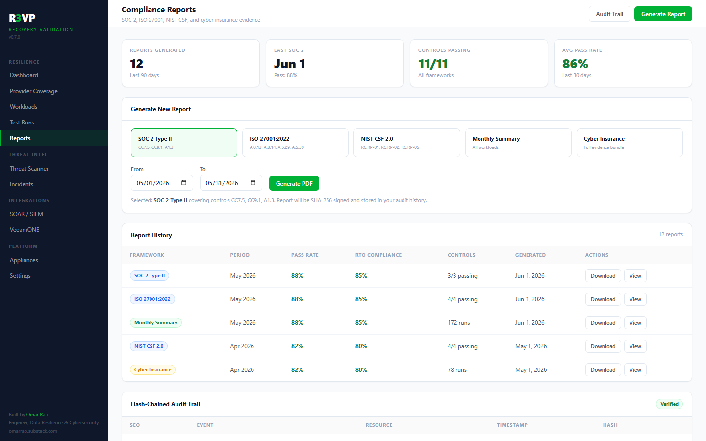

The providers page shows a 10-provider card grid with workload counts, test run history, average RTO, and pass rate bars for all configured platforms. An extended hypervisor support matrix below the Veeam version table covers snapshot capabilities and isolation method for each new platform.

See [docs/phases/phase-6.md](docs/phases/phase-6.md) for full connector reference, auth requirements, environment variables, and database migration details.

### Veeam B&R Version Support

| Version | API | Instant Recovery | Veeam Inline Malware Events |
|---|---|---|---|
| Veeam 10.x | v1.0 | Not supported | No |
| Veeam 11.x | v1.0 | Supported | No |
| Veeam 12.x | v1.1 | Supported | No |
| Veeam 13.0.2+ | v1.2 | Supported | Yes |

R3VP auto-detects the Veeam version at startup. No manual version configuration needed.

### Phase 4: Threat Intelligence and Incident Response

R3VP Phase 4 adds an active threat detection layer that runs alongside recovery validation.

**Threat signature database.** The appliance carries a local SQLite database synced every 6 hours from the R3VP cloud threat intelligence feed. It contains ransomware family signatures (LockBit, BlackCat/ALPHV, Cl0p, Royal, Black Basta, and others), malware file hashes, APT behavioral indicators mapped to MITRE ATT&CK, critical CVEs for Veeam and VMware infrastructure, and YARA rules.

**Automated scanning.** The appliance scans running processes, file system paths, active network connections, Windows registry persistence locations, and Veeam service configuration every hour. Scans can also be triggered on demand from the portal. Findings are cross-referenced against the threat database and YARA rule set, then reported to the portal in real time over a server-sent events connection.

**SOAR and SIEM integration.** When a threat at HIGH or CRITICAL severity is confirmed, R3VP automatically sends a structured alert to your SOAR platform (Splunk SOAR or Palo Alto XSOAR) and emits a CEF/LEEF/JSON-Syslog event to your SIEM (Splunk, IBM QRadar, Microsoft Sentinel). Every event includes the threat name, severity, affected host, IOCs, and the MITRE ATT&CK technique mapping.

**Auto-backup on threat detection.** The moment a ransomware signature or critical threat is confirmed, R3VP immediately triggers a Veeam backup of the affected VM to preserve a clean pre-incident restore point. This happens automatically before any encryption or data loss can progress further.

**VeeamONE reporting.** Recovery test results and threat detection events are pushed to VeeamONE dashboards via the VeeamONE REST API, giving your infrastructure team a unified view of backup health and threat status in one place.

---

## Screenshots

### Recovery Readiness Dashboard

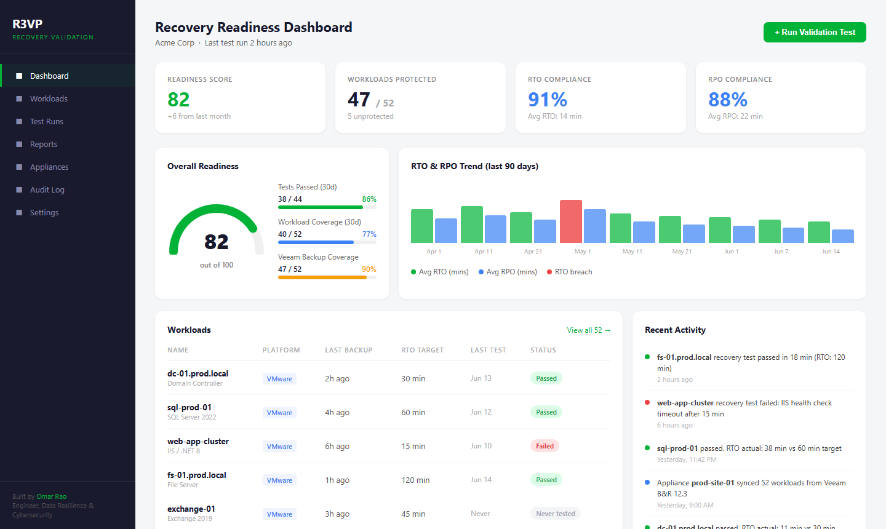

The dashboard shows readiness score, workload coverage across all 10 providers, RTO compliance, active threat count, and a recent test runs table. The Provider Coverage widget displays all 10 platforms in a 5x2 grid with color-coded pass rate bars. The Run Validation Test button opens a modal with an inline workflow diagram and configuration form.

### Provider Coverage


The providers page uses a tabbed interface with one tab per provider. Each tab shows workload count, test run totals, average RTO, pass rate, a recent test runs table, and protocol and authentication details for that connector. The Veeam B&R version support matrix at the bottom shows which API features are available per Veeam release.

### Workloads

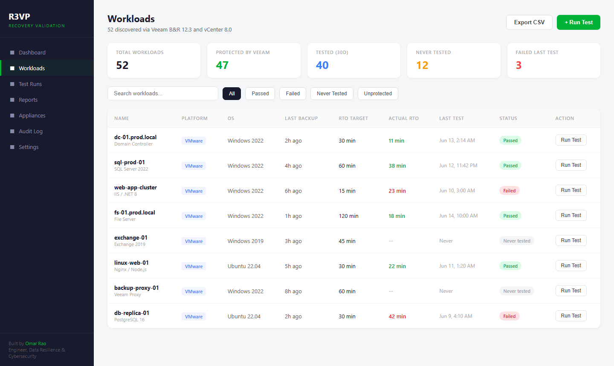

The workloads view lists every VM discovered across all providers. Filter by provider or status. Each row shows last tested date, RTO target vs actual, a pass rate bar, and a quick Test button.

### Test Run Detail

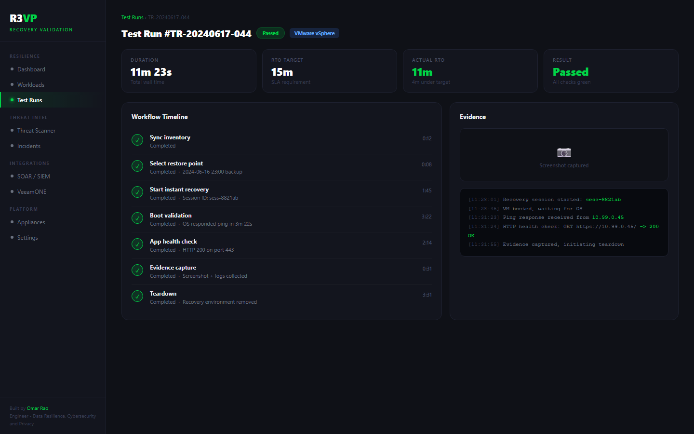

Each test run shows the full 7-step validation workflow with step durations, the restore point selected, actual RTO measurement, health check results, and the captured evidence log.

### Threat Intelligence Console

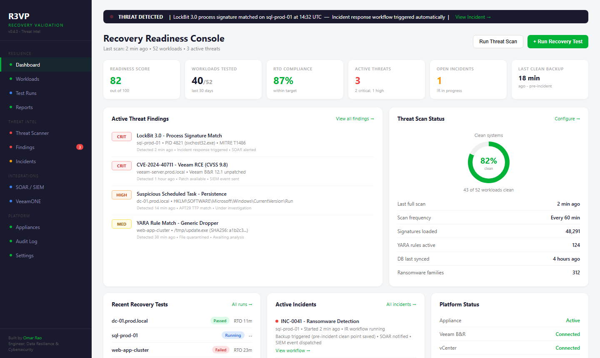

The console combines recovery validation and threat intelligence in one view. A live alert banner highlights active detections. The KPI row shows readiness score, workload coverage, active threat count, open incidents, and time since last clean backup. Active threat findings, scan status with donut chart, recent test runs, and platform connection status are shown below.

### Threat Scanner

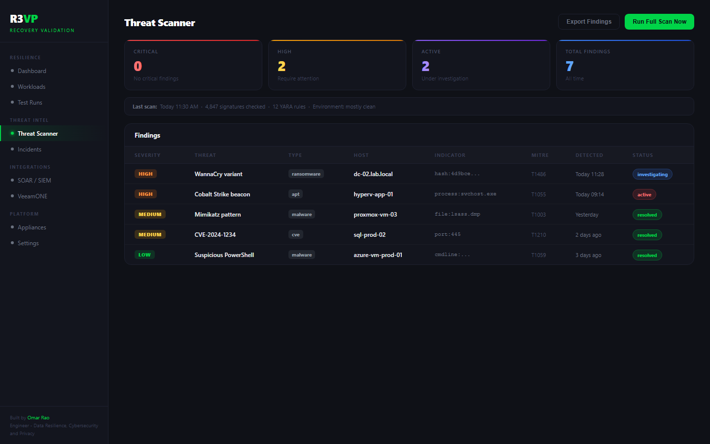

The threat scanner shows all findings from signature database cross-reference, YARA rule matches, and CVE detections. Each finding shows severity, threat family, affected host, MITRE ATT&CK technique, and current status.

### Incident Response

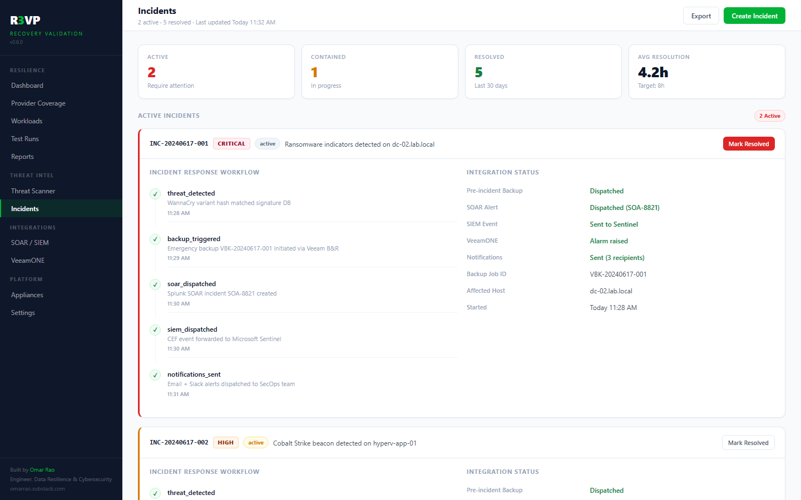

The incidents page tracks the full automated response workflow: threat detection to pre-incident backup to SOAR/SIEM dispatch to SecOps notification. Each active incident card shows a timestamped response timeline and integration dispatch status side by side.

### Compliance Reports


The reports page lets auditors generate signed PDF evidence for SOC 2 Type II, ISO 27001:2022, NIST CSF 2.0, cyber insurance, and monthly summaries. Reports are SHA-256 signed at generation time. The audit trail panel shows the hash-chained log with chain integrity status.

### Scheduled Delivery

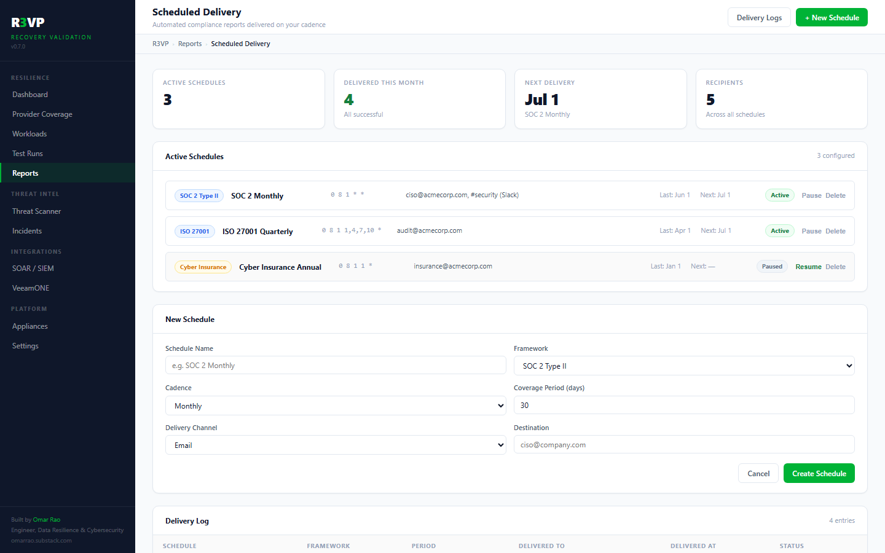

Configure recurring report delivery on daily, weekly, monthly, or quarterly cadences. Each schedule defines which framework to report on, how far back the report period covers, and where to deliver: email address, Slack incoming webhook, or Teams webhook. A delivery log tracks every sent report with per-recipient status.

### Evidence Vault

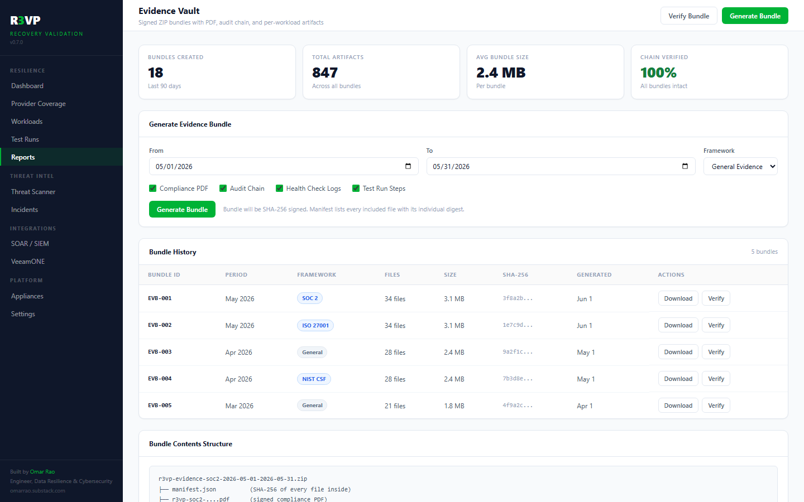

The evidence vault assembles signed ZIP bundles per period containing the compliance PDF, the full audit chain export, and per-workload artifacts (test summary, step durations, health check results). Every bundle has a SHA-256 manifest that lists the digest of each included file for tamper-evidence verification.

### Team Management

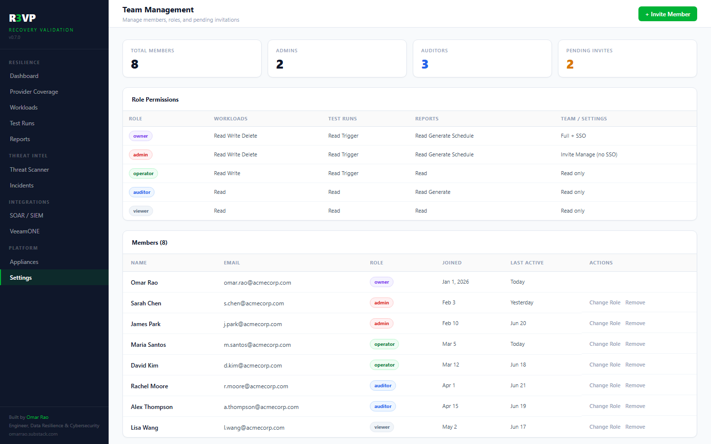

Team management gives org admins full control over who can access R3VP and what they can do. Five built-in roles (owner, admin, operator, auditor, viewer) cover every enterprise access pattern. External auditors can be invited with read-only access to reports and evidence without touching workload configuration. The role permissions reference table shows exactly which capabilities each role carries.

### API Keys

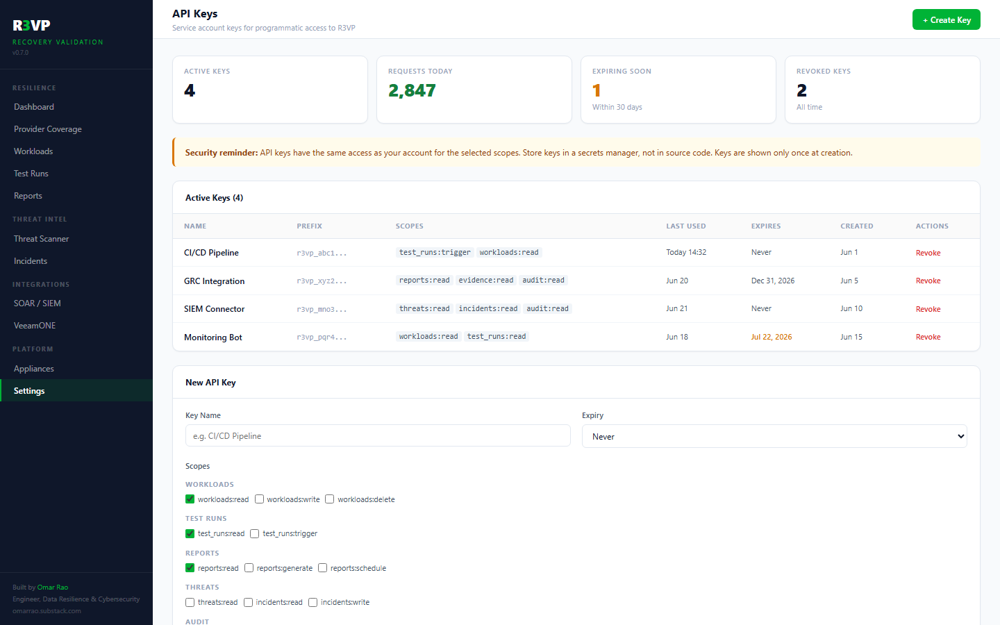

Service account API keys let CI/CD pipelines, GRC tools, and SIEM connectors access R3VP programmatically. Each key is scoped to a specific set of permissions and the raw key value is shown only once at creation. Keys can be set to expire and are revoked immediately on demand.

### Single Sign-On

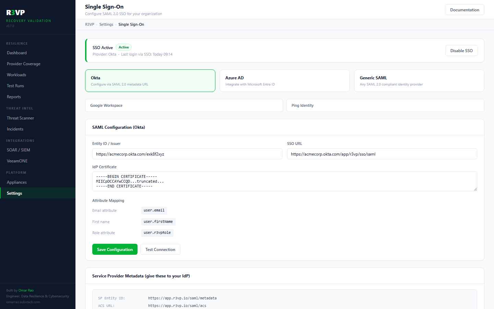

SAML 2.0 SSO integrates R3VP with Okta, Microsoft Entra ID, Google Workspace, Ping Identity, and any generic SAML 2.0 provider. Org owners configure the IdP certificate and attribute mapping, then share the SP metadata with their identity provider. SSO can be toggled without losing the configuration.

### CISO Scorecard

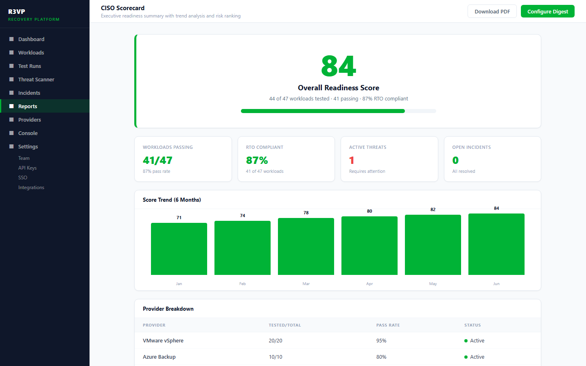

The CISO scorecard produces a single 0-100 readiness score from four weighted factors: workload coverage (40%), pass rate (35%), RTO compliance (15%), and a threat penalty. A 6-month trend chart, provider breakdown, and top risk ranking are included. The scorecard downloads as a signed PDF and can be delivered automatically on a weekly, monthly, or quarterly digest schedule.

### Integrations

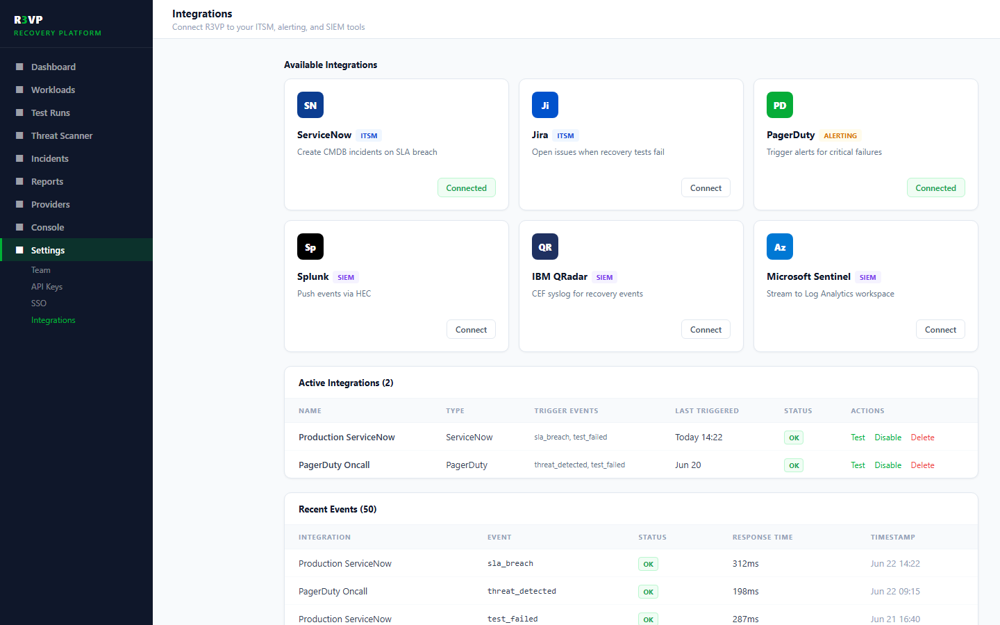

The integrations marketplace connects R3VP to six external tools: ServiceNow and Jira for ITSM ticket creation, PagerDuty for on-call alerting, and Splunk, IBM QRadar, and Microsoft Sentinel for SIEM event streaming. Each integration subscribes to specific trigger events (SLA breach, test failure, threat detection, incident creation) and every dispatch attempt is logged with status and response time.

### AI Insights

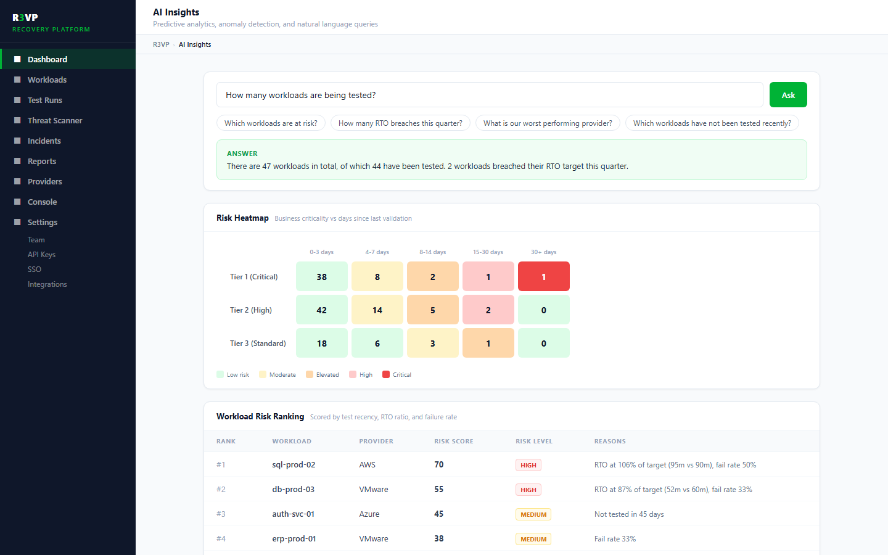

The AI insights module provides three capabilities without an external LLM dependency: RTO trend prediction using linear regression to flag workloads trending toward breach before it happens, statistical anomaly detection over recovery time series using z-score analysis, and a natural language query interface for common recovery posture questions. Workloads are ranked by a composite risk score across test recency, RTO proximity, and failure rate.

### DR Runbooks

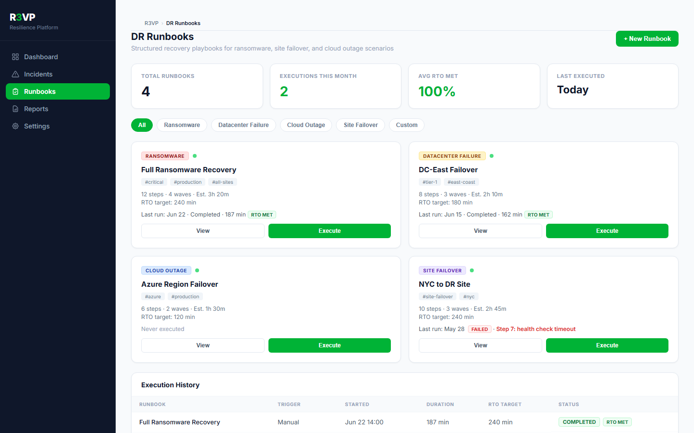

The runbooks page lists all recovery playbooks organised by scenario: ransomware, datacenter failure, cloud outage, site failover, and custom. Each runbook card shows the wave count, estimated duration, RTO target, and last execution result. Scenario filter pills let operators jump straight to the relevant playbook during an incident.

### Runbook Execution

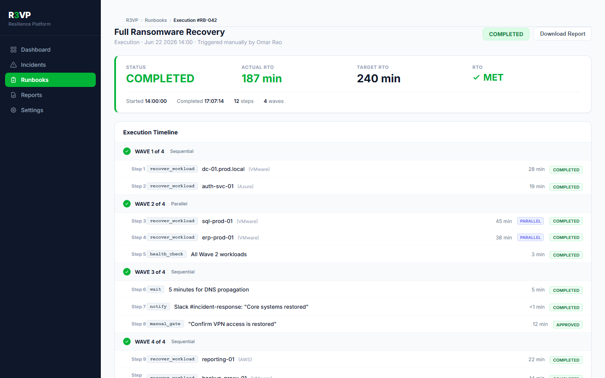

The execution detail view shows a live wave-by-wave timeline with per-step status, duration, and output. Steps display their type (recover workload, health check, notify, wait, manual gate, run script), and the step detail panel shows the full JSON output from each activity. Actual RTO is computed at completion and compared to the runbook target.

### Onboarding Wizard

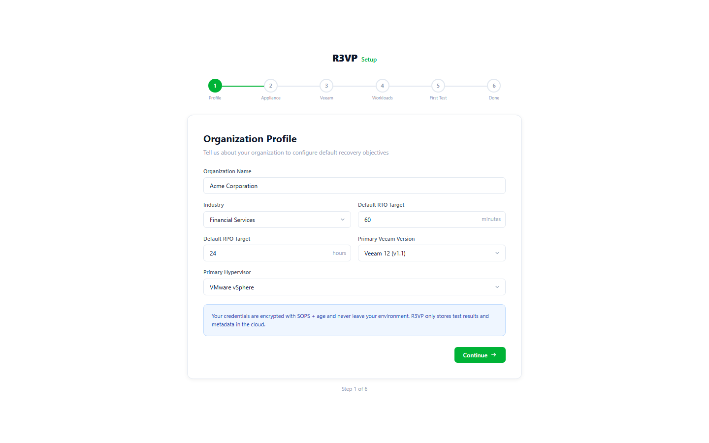

The self-service onboarding wizard guides new organizations from signup to first validated recovery test without professional services. A six-step horizontal stepper covers org profile, appliance deployment (Docker or OVA), Veeam B&R connection, workload discovery, and first test execution. Credentials are encrypted with SOPS and age on the appliance and never transmitted to the cloud.

### Appliance Fleet

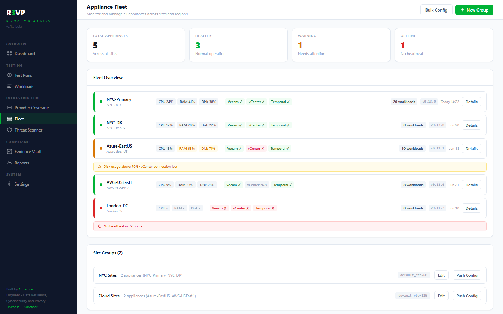

The fleet management page provides a unified view across all deployed appliances. Each appliance row shows a status-colored border (green / amber / red), resource utilization bars, and connection state badges for Veeam, vCenter, and Temporal. Site groups allow bulk configuration templates to be pushed to multiple appliances simultaneously. A bulk config editor accepts a JSON payload and dispatches it as an async job with per-appliance result tracking.

### MSSP Console

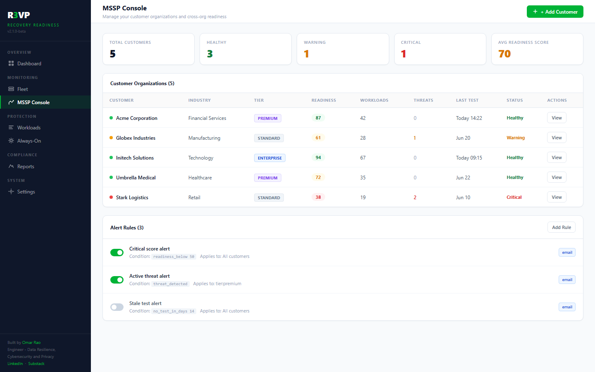

The MSSP console gives managed service providers a single pane of glass across all customer organizations. A five-column KPI row shows total customers, health breakdown, and average readiness score. The customer table displays per-org tier badges (standard, premium, enterprise), readiness score pills, workload counts, active threat counts, and last test date. Alert rules can be scoped to all customers, a specific tier, or a tag, and fire on conditions like score drops, RTO breaches, threat detection, and stale tests.

### Compliance Frameworks

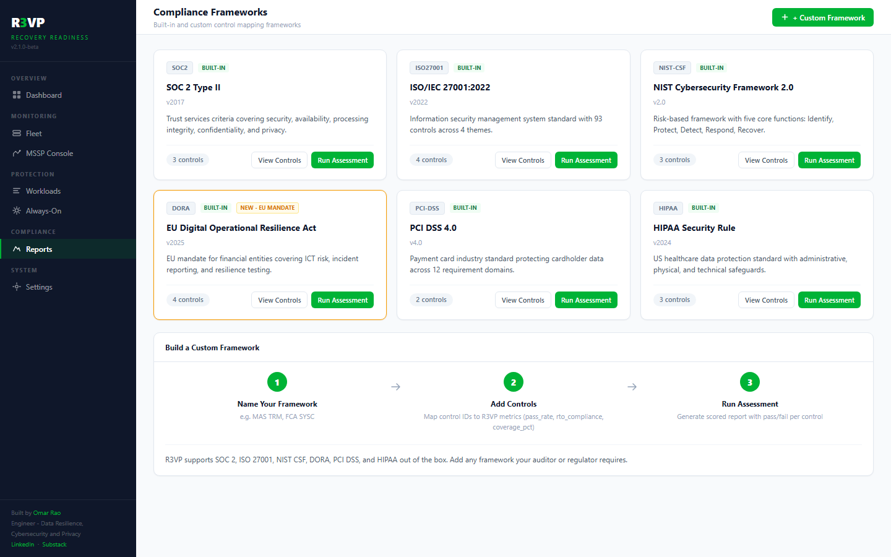

The compliance framework page ships six built-in frameworks: SOC 2 Type II, ISO/IEC 27001:2022, NIST CSF 2.0, EU DORA (highlighted as a current mandate), PCI DSS 4.0, and HIPAA Security Rule. A three-step custom framework builder lets organizations add any regulation by naming the framework, mapping control IDs to R3VP metrics (pass rate, RTO compliance, workload coverage), and running a scored assessment. Assessment results are stored per period for audit history.

### Continuous Validation

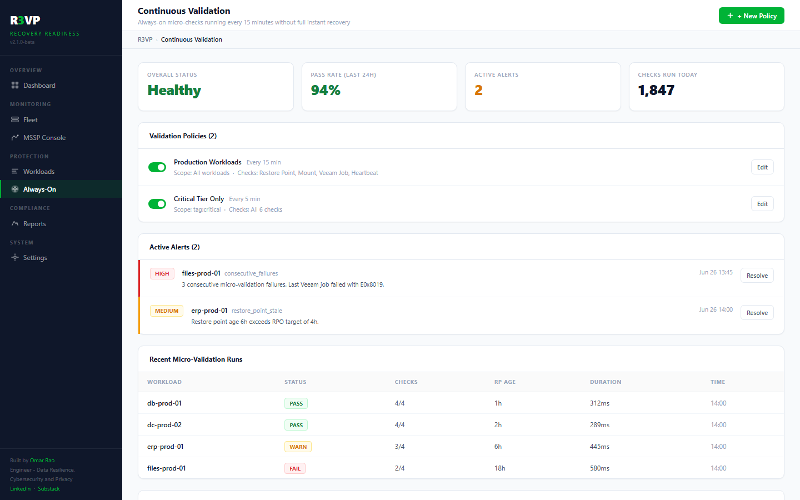

Continuous validation runs six lightweight micro-checks against every workload on a configurable interval (default: every 15 minutes) without triggering full instant recovery. Checks cover restore point freshness, mount endpoint reachability, Veeam job status, appliance heartbeat, vCenter connectivity, and RPO compliance. Active alerts show severity-coded left borders with one-click resolution. A rolling pass rate and consecutive failure counter provide early warning before a scheduled full recovery test would catch the issue.

### User Analytics

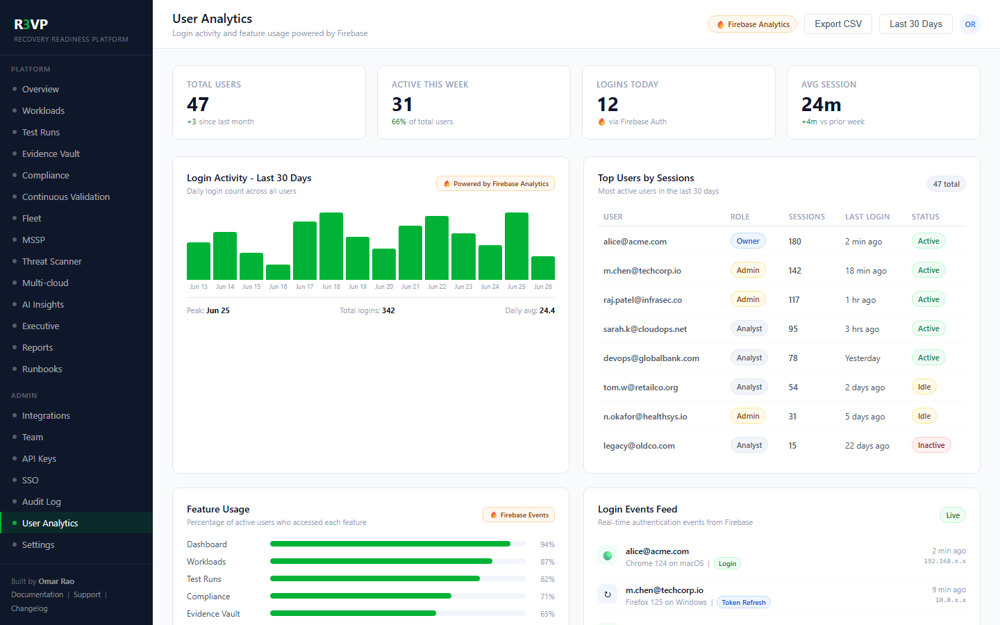

The user analytics page tracks login activity, session counts, and feature usage across the portal using Firebase Analytics (free Spark plan). KPIs show total users, active users this week, logins today, and average session duration. A 30-day login activity chart, top-users table by session count, feature usage breakdown, and a live login events feed give administrators full visibility into how the platform is being used without any external paid service.

---

## Live Demo

R3VP ships a self-contained demo mode at `/demo` that is protected by **Firebase Authentication** (free). Anyone can sign in with a Google account or email/password and explore the full portal UI with realistic sample data - no appliance, no backend, no configuration needed.

### Demo login

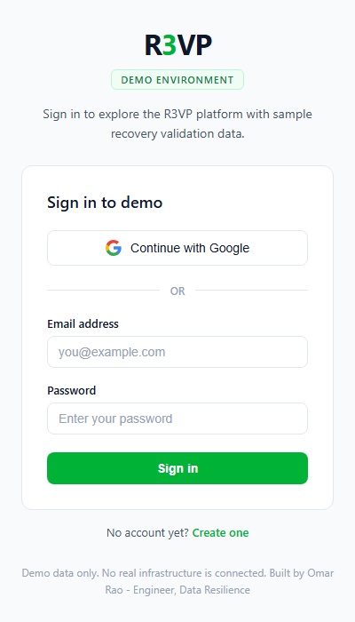

### Demo dashboard

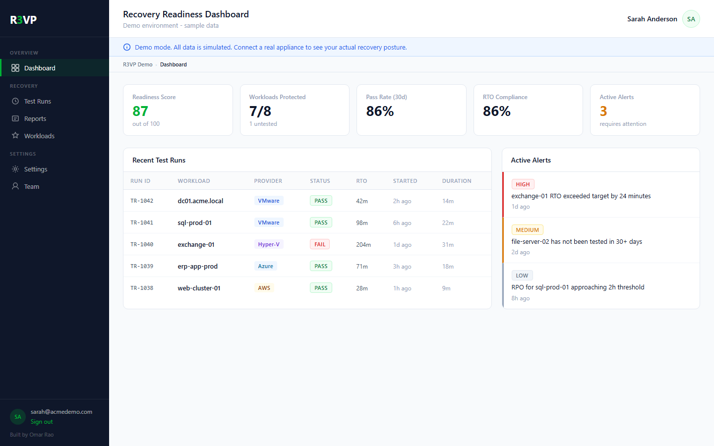

The demo dashboard shows live KPIs, a recent test runs table, and an active alerts panel all populated with sample recovery validation data. The sidebar gives access to all portal sections. A blue banner reminds the viewer that data is simulated.

### Setting up Firebase for the demo

1. Create a free Firebase project at [https://console.firebase.google.com](https://console.firebase.google.com)
2. Add a **Web app** to the project and copy the config values
3. In the Firebase console, go to **Authentication > Sign-in method** and enable **Google** and **Email/Password**
4. Copy `apps/portal/.env.local.example` to `apps/portal/.env.local` and fill in the `NEXT_PUBLIC_FIREBASE_*` values
5. Run `npm run dev` and visit `http://localhost:3000/demo`

The demo works without Auth0 or any backend API. Firebase credentials are only required for the `/demo` route - the main portal still uses Auth0.

---

## User Guide

A comprehensive technical user guide covering every feature, architecture details, installation walkthroughs, API reference, security design, and troubleshooting is maintained at:

**[docs/user-guide.md](docs/user-guide.md)**

The guide is versioned alongside the codebase. Every release that adds or changes a feature also updates the corresponding section in the guide. The guide includes:

- Full architecture diagram and component data flows
- Step-by-step appliance deployment (Docker, OVA, AWS EC2)
- Veeam and vCenter service account configuration
- All 21 portal features documented with screenshots
- RBAC permissions matrix (24 permissions across 5 roles)
- API reference summary per module
- Environment variables reference
- Security architecture notes
- Troubleshooting guide

---

## Architecture

```
Customer Environment                          Cloud (SaaS)
+------------------------------+              +---------------------------+
|  R3VP Appliance (Docker)     |              |  SaaS API (FastAPI)       |
|                              |  mTLS HTTPS  |                           |
|  - Veeam B&R Connector  -----+------------->|  - Appliance relay        |
|  - vCenter Connector         |              |  - Workload inventory     |
|  - Recovery Workflow Engine  |              |  - Test run management    |
|  - Health Checks             |              |  - Readiness scoring      |
|  - SOPS encrypted vault      |              |  - Evidence storage (S3)  |
|                              |              |  - Temporal workflows     |
+------------------------------+              +---------------------------+
                                                          |
                                              +---------------------------+
                                              |  Portal (Next.js)         |
                                              |  - Dashboard              |
                                              |  - Workload grid          |
                                              |  - Test run detail        |
                                              |  - Reports + Audit log    |
                                              +---------------------------+
```

**Phase 4 Architecture (Threat Intelligence layer):**

```
Customer Environment                          Cloud (SaaS)
+-------------------------------------+       +-------------------------------+
|  R3VP Appliance (Docker)            |       |  SaaS API (FastAPI)           |
|                                     | mTLS  |                               |
|  - Threat Scanner (hourly)     -----+------>|  - Threat findings relay      |
|  - Signature DB (SQLite, synced)    |       |  - Incident management        |
|  - YARA Rules Engine                |       |  - VeeamONE push              |
|  - Incident Response Trigger        |       |  - SSE notification stream    |
|  - SOAR webhook client              |       +-------------------------------+
|  - SIEM syslog/CEF emitter          |                   |
+-------------------------------------+       +-------------------------------+
                                              |  Portal (Next.js)             |
                                              |  - Threat Scanner page        |
                                              |  - Findings table             |
                                              |  - Incidents + IR workflow    |
                                              |  - SOAR/SIEM config           |
                                              |  - Live notification bar      |
                                              +-------------------------------+
```

**Tech stack:**

| Layer | Technology |
|-------|-----------|
| Appliance runtime | Python 3.12 + uv, Docker or OVA |
| Workflow orchestration | Temporal.io (durable, saga teardown pattern) |
| Veeam integration | Veeam B&R REST API v1.1 |
| VMware integration | pyVmomi |
| SaaS backend | FastAPI + SQLAlchemy async + PostgreSQL 16 |
| SaaS frontend | Next.js 15 + Auth0 + Recharts + Firebase Analytics |
| Credential security | SOPS + age (credentials encrypted at rest, never leave customer environment) |
| mTLS | httpx with client certificates, thumbprint verified on every request |
| Evidence storage | AWS S3 with KMS encryption |

---

## Installing the Appliance

### Prerequisites

- Docker Engine 24+ (or Docker Desktop)
- Network access to your Veeam B&R server (port 9419 for REST API)
- Network access to your vCenter server (port 443)
- Outbound HTTPS to the R3VP SaaS portal (app.r3vp.io:443)

### On-Premises Install (Docker Compose)

**Step 1: Get the appliance files**

```bash
curl -sSL https://get.r3vp.io/install.sh | bash -s -- --dir /opt/r3vp
cd /opt/r3vp
```

Or clone this repo and copy the appliance directory:

```bash
git clone https://github.com/omarrao/r3vp.git
cd r3vp/apps/appliance
```

**Step 2: Generate mTLS certificates**

```bash
# Linux / macOS
bash infra/scripts/gen-mtls-certs.sh --out /opt/r3vp/certs

# Windows PowerShell
.\infra\scripts\gen-mtls-certs.ps1 -OutDir C:\r3vp\certs
```

This creates a CA, a client certificate signed by that CA, and prints the certificate thumbprint. You will register this thumbprint in the portal when you add the appliance.

**Step 3: Configure credentials**

Copy the secrets template and fill in your Veeam and vCenter details:

```bash
cp apps/appliance/src/vault/secrets.template.yaml /opt/r3vp/vault/secrets.yaml
```

Edit `/opt/r3vp/vault/secrets.yaml`:

```yaml
veeam_password: "your-veeam-service-account-password"
vcenter_password: "your-vcenter-service-account-password"
```

Encrypt it with age (the appliance decrypts this at startup; delete the plaintext file after encryption):

```bash
# Generate an age key if you do not have one
age-keygen -o /opt/r3vp/vault/age.key

# Encrypt the secrets file
sops --encrypt --age $(grep "public key" /opt/r3vp/vault/age.key | awk '{print $NF}') \
  /opt/r3vp/vault/secrets.yaml > /opt/r3vp/vault/secrets.enc.yaml

# Remove the plaintext file
rm /opt/r3vp/vault/secrets.yaml
```

**Step 4: Set environment variables**

Create `/opt/r3vp/.env`:

```env
R3VP_APPLIANCE_ID=your-appliance-uuid-from-portal
R3VP_ORG_ID=your-org-uuid-from-portal
R3VP_SAAS_BASE_URL=https://api.r3vp.io
R3VP_MTLS_CERT_PATH=/certs/client.crt
R3VP_MTLS_KEY_PATH=/certs/client.key
R3VP_MTLS_CA_PATH=/certs/ca.crt
R3VP_VEEAM_URL=https://your-veeam-server:9419
R3VP_VEEAM_USERNAME=svc_r3vp@domain.local
R3VP_VCENTER_HOST=your-vcenter.domain.local
R3VP_VCENTER_USERNAME=svc_r3vp@vsphere.local
R3VP_ISOLATED_VLAN_ID=4090
R3VP_VAULT_PATH=/vault/secrets.enc.yaml
R3VP_AGE_KEY_PATH=/vault/age.key
```

**Step 5: Start the appliance**

```bash
docker compose up -d
docker compose logs -f
```

You should see the appliance register with the portal and start syncing inventory within about 30 seconds.

---

### Cloud Install (AWS EC2)

Use this approach if you want to run the appliance on a cloud VM that has connectivity back into your on-premises environment via VPN or Direct Connect, or if you are running a fully cloud-native Veeam deployment.

**Step 1: Launch an EC2 instance**

Recommended: `t3.small`, Amazon Linux 2023, in the same VPC as your Veeam server or with VPN access to it.

```bash
# Install Docker
sudo dnf install -y docker
sudo systemctl enable --now docker
sudo usermod -aG docker ec2-user

# Log out and back in, then verify
docker version
```

**Step 2: Install the appliance**

```bash
curl -sSL https://get.r3vp.io/install.sh | bash -s -- --dir /opt/r3vp
cd /opt/r3vp
```

Then follow Steps 2-5 from the on-premises install above. The process is identical. For cloud deployments, consider storing the age private key in AWS Secrets Manager instead of on disk:

```bash
# Store the key in Secrets Manager
aws secretsmanager create-secret \
  --name r3vp/appliance/age-key \
  --secret-string file:///opt/r3vp/vault/age.key

# In your .env, set this instead of R3VP_AGE_KEY_PATH
R3VP_AGE_KEY_SECRET_ARN=arn:aws:secretsmanager:us-east-1:123456789012:secret:r3vp/appliance/age-key
```

**Step 3: Run as a systemd service**

```bash
sudo tee /etc/systemd/system/r3vp-appliance.service > /dev/null <<EOF
[Unit]
Description=R3VP Appliance
After=docker.service
Requires=docker.service

[Service]
WorkingDirectory=/opt/r3vp
ExecStart=/usr/bin/docker compose up
ExecStop=/usr/bin/docker compose down
Restart=always
RestartSec=10

[Install]
WantedBy=multi-user.target
EOF

sudo systemctl enable --now r3vp-appliance
```

---

### OVA Install (VMware vSphere)

For environments that prefer a pre-packaged appliance rather than Docker:

1. Download the OVA from the portal (Appliances > Deploy New Appliance > Download OVA)
2. Deploy it to vCenter: Actions > Deploy OVF Template
3. During deployment, fill in the OVF properties (the portal pre-fills these for you when you create the appliance entry first)
4. Power on. The appliance boots, reads its OVF properties, and registers with the portal automatically.

The OVA runs the same Docker container internally on a minimal Ubuntu 22.04 base. No configuration files to edit.

---

## Veeam Configuration

R3VP uses a service account with read-only access to Veeam B&R plus the ability to start and stop instant recovery sessions. It does not need admin rights.

### Supported Versions

| Veeam Version | API Version | Support Level |
|---------------|-------------|---------------|
| Veeam B&R 12.3 | REST API v1.1 | Full (recommended) |
| Veeam B&R 12.1 | REST API v1.1 | Full |
| Veeam B&R 12.0 | REST API v1.1 | Full |
| Veeam B&R 11a | REST API v1.0 | Full |
| Veeam B&R 11 | REST API v1.0 | Full |
| Veeam B&R 10 | REST API v1 | Partial (no instant recovery API) |

For Veeam 10, R3VP falls back to PowerShell remoting via WinRM for operations not covered by the v1 API.

### Creating the Service Account

On your Veeam B&R server, open the Veeam Backup and Replication console:

1. Go to **Users and Roles** (top menu > Users and Roles)
2. Click **Add**
3. Create a Windows local account or domain account: `svc_r3vp`
4. Assign the role: **Veeam Restore Operator**

The Restore Operator role allows reading backup jobs and restore points, and starting and stopping instant recovery sessions. It does not allow deleting backups, modifying job schedules, or any other administrative actions.

### Enabling the REST API (Veeam 12)

The REST API is enabled by default in Veeam 12. Verify it is running:

```powershell
Get-Service "Veeam Backup RESTful API Service"
```

If it shows Stopped:

```powershell
Start-Service "Veeam Backup RESTful API Service"
Set-Service "Veeam Backup RESTful API Service" -StartupType Automatic
```

The default port is 9419. Verify access from the appliance host:

```bash
curl -k https://your-veeam-server:9419/api/v1/serverInfo
```

### Enabling the REST API (Veeam 11 and Earlier)

In Veeam 11, the REST API may need to be enabled manually:

1. Open the Veeam Backup and Replication console
2. Go to **Main Menu > General Options > REST API**
3. Check **Enable REST API**
4. Set port to 9419
5. Click OK and restart the Veeam service

### API Version Detection

R3VP automatically detects which version of the REST API your Veeam server supports by calling `/api/v1/serverInfo` at startup. It picks the right client behavior based on the version returned. You do not need to configure this manually.

For Veeam 12.x (`buildVersion` starting with `12.`), R3VP uses the full v1.1 API including the instant recovery management endpoints added in Veeam 12.

For Veeam 11.x, R3VP uses v1.0 and supplements missing functionality via WinRM where needed.

### Firewall Rules

Allow the appliance host to reach your Veeam server:

```
Appliance IP -> Veeam server : TCP 9419   (REST API, all versions)
Appliance IP -> Veeam server : TCP 5985   (WinRM HTTP, Veeam 10 fallback only)
```

---

## vCenter Configuration

R3VP needs a service account in vCenter with permissions to read VM inventory, create and remove port groups for isolated test networks, and take console screenshots.

### Creating the Service Account

In vCenter:

1. Go to **Administration > Single Sign On > Users and Groups**
2. Create a new user: `svc_r3vp@vsphere.local` (or your AD domain)
3. Go to **Administration > Access Control > Roles**
4. Create a new role: `R3VP Operator` with these privileges:
   - Virtual machine > Interaction > Console interaction
   - Network > Assign network
   - Network > Configure
   - Distributed switch > Port group > Create
   - Distributed switch > Port group > Delete
   - Datastore > Browse datastore
5. Go to **Hosts and Clusters**, select your datacenter
6. Click **Permissions > Add**
7. Assign the `R3VP Operator` role to `svc_r3vp`, check **Propagate to children**

### Isolated Network Setup

R3VP creates temporary port groups on your distributed virtual switch for each test run. The port group is created before the test and removed after teardown. Set these in your `.env`:

```env
R3VP_ISOLATED_VLAN_ID=4090
R3VP_DVS_NAME=DSwitch-Prod
```

Pick a VLAN ID that is not routed anywhere in your environment. It only needs to exist inside vCenter.

---

## Project Structure

```
r3vp/
  apps/
    appliance/          Python appliance (runs inside customer environment)
      src/
        connectors/
          veeam/        Veeam B&R REST API client (v1.0 and v1.1)
          vcenter/      VMware vCenter client (pyVmomi)
        workflows/      Temporal workflow and activities
        health_checks/  OS, AD, SQL, DNS health check implementations
        relay/          mTLS client that talks to SaaS API
        vault/          SOPS+age secret decryption
    api/                SaaS backend (FastAPI + PostgreSQL)
      src/
        routers/        appliances, workloads, test_runs, readiness, audit
        models/         SQLAlchemy ORM models
        services/       Business logic
        db/             Alembic migrations
    portal/             SaaS frontend (Next.js 14 + Auth0)
      app/              App Router pages
      components/       ReadinessGauge, RtoRpoChart, WorkloadGrid
  infra/
    terraform/          AWS infrastructure (RDS, S3, ECS)
    scripts/            mTLS cert generation scripts
  docs/
    adr/                Architecture Decision Records
    screenshots/        UI mockups and screenshots
  .github/
    workflows/          CI: lint, test, docker build
```

---

## Development Setup

### Prerequisites

- Python 3.12
- [uv](https://docs.astral.sh/uv/)
- Node.js 20+
- Docker Desktop

### Appliance

```bash
cd apps/appliance
uv sync
uv run pytest
```

### API

```bash
cd apps/api
uv sync
docker compose up -d postgres
uv run alembic upgrade head
uv run uvicorn src.main:app --reload
```

### Portal

```bash
cd apps/portal
npm install
cp .env.local.example .env.local
# Fill in Auth0 values in .env.local
npm run dev
```

---

## Security Design

**Credentials never leave your environment.** Veeam and vCenter passwords are stored in a SOPS-encrypted YAML file inside your environment. The appliance decrypts them at startup using an age key you control. The SaaS portal never sees these credentials.

**mTLS on every request.** The appliance presents a client certificate on every call to the SaaS API. The API verifies the certificate thumbprint matches the registered appliance record. A compromised API token without the matching certificate is useless.

**Isolated test networks.** Recovery tests run in a temporary VLAN that has no route to your production network. The recovered VM cannot communicate with any production system during the test.

**Read-only by default.** The Veeam service account only has Restore Operator permissions. It cannot modify backup jobs or delete restore points.

---

## License

MIT License. See [LICENSE](LICENSE).

---

**Built by Omar Rao, Engineer - Data Resilience, Cybersecurity and Privacy**
[LinkedIn](https://www.linkedin.com/in/omarrao/) | [Substack](https://omarrao.substack.com/)
