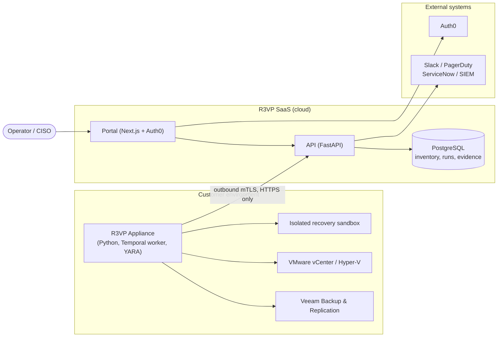
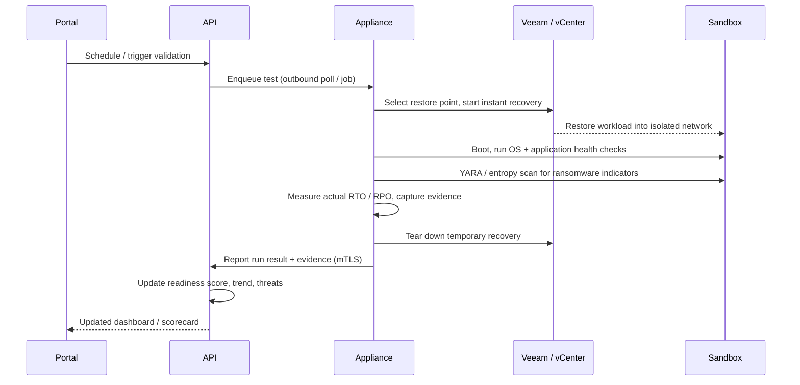
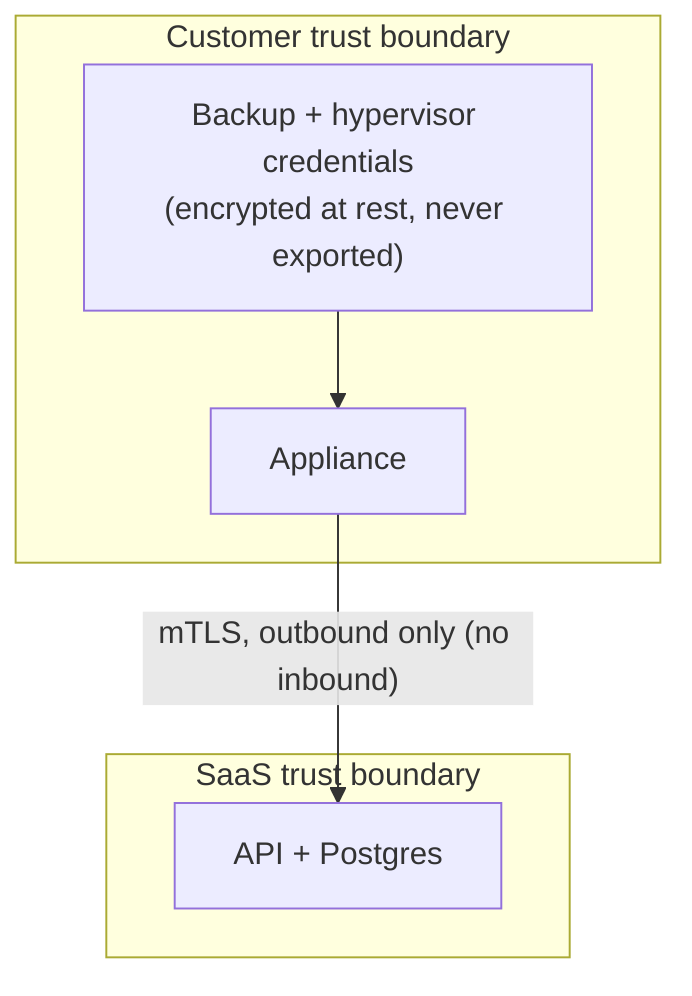

# R3VP System Architecture

R3VP validates ransomware recovery readiness by running automated,
isolated recovery tests against real backups and scoring the results. It
is split across a customer-hosted appliance and a cloud-hosted SaaS so that
customer credentials never leave the customer environment.

Related decisions: [ADR-001 Appliance runtime](adr/001-appliance-runtime.md),
[ADR-002 Temporal workflow engine](adr/002-temporal-workflow-engine.md),
[ADR-003 Veeam/vCenter recovery connector](adr/003-veeam-vcenter-recovery-connector.md).

## System context

Key property: the appliance dials **out** to the SaaS over mutually
authenticated TLS. The SaaS never opens a connection into the customer
network, and backup/hypervisor credentials stay inside the appliance.

## Component responsibilities

| Component | Stack | Responsibility |
|-----------|-------|----------------|
| Appliance | Python, Temporal worker, pyVmomi, YARA | Discovers protected workloads, selects restore points, runs isolated recovery tests, measures actual RTO/RPO, scans restored data for ransomware, captures evidence, tears down the sandbox |
| API | FastAPI, SQLAlchemy (async), Alembic | Asset inventory, readiness scoring, RBAC, reporting, integrations, MSSP multi-tenant management |
| Database | PostgreSQL 16 | Workloads, test runs and steps, health checks, threat scans/findings, scorecards, audit chain |
| Portal | Next.js 15, Auth0, Firebase | Dashboards, scorecards, evidence, admin |
| Workflow engine | Temporal | Durable orchestration of the multi-step recovery test workflow |

## Recovery-test data flow

## Readiness score

The composite readiness score (0-100) is computed in
`apps/api/src/services/readiness_scoring.py` and
`services/executive_report.py`:

- 40% coverage (workloads tested / total)
- 35% pass rate (workloads passing / tested)
- 15% RTO compliance (passed runs meeting their RTO target)
- up to 10-point penalty for active threats and open incidents

## Trust and isolation boundaries

